# Solace Distributed Tracing Observatory

[](docker-compose.yaml)
[](https://solace.com/products/event-broker/)
[](https://opentelemetry.io/)
[](https://grafana.com/oss/tempo/)

Distributed tracing for a Solace PubSub+ broker, collected via the broker's
native telemetry/trace feature over AMQP, bridged into OpenTelemetry by the
`solace` receiver, stored in Grafana Tempo, and explored in Grafana.

This reproduces a working OpenShift deployment without OpenShift — no
operators, no CRs, no cloud object store. Same architecture, same failure
modes, same lessons; plain containers instead. It's the tracing pillar of the
same effort as `solace-metrics` (Prometheus/Grafana metrics) on this repo.

```mermaid
flowchart LR

    classDef client fill:#F9FAFB,stroke:#4B5563,stroke-width:2px,color:#111827;
    classDef broker fill:#FFF5E6,stroke:#D97706,stroke-width:2px,color:#111827;
    classDef monitor fill:#ECFDF5,stroke:#059669,stroke-width:2px,color:#111827;
    classDef storage fill:#EFF6FF,stroke:#2563EB,stroke-width:2px,color:#111827;
    classDef ui fill:#F5F3FF,stroke:#7C3AED,stroke-width:2px,color:#111827;

    A["Client Applications<br/><br/>sdkperf • JMS • JCSMP • MQTT • REST"]

    subgraph Broker["Messaging Platform"]
        B["Solace PubSub+ Broker"]
        C["Telemetry Queue<br/>#telemetry-trace · AMQP :5672"]
    end

    subgraph Observability["Observability Stack"]
        D["OTel Collector<br/>OTLP :4317 / :4318 in"]
        E["Tempo<br/>14d retention · :3200"]
        F["Grafana<br/>:3000"]
    end

    A -->|"SMF"| B
    B -.->|"spans on matching topics"| C
    C -->|"AMQP + trace_user"| D
    D -->|"OTLP gRPC"| E
    E -->|"TraceQL"| F

    class A client
    class B broker
    class C,D monitor
    class E storage
    class F ui
    style Broker fill:#FFFBEB,stroke:#D97706,color:#111827
    style Observability fill:#FAF5FF,stroke:#7C3AED,color:#111827
```



---

## Get this branch

This work lives on its own branch, separate from `main` and from
`solace-metrics` (the metrics pillar):

```bash
git clone --branch grafana-dt https://github.com/Tanendra77/solace-grafana-observatory.git
cd solace-grafana-observatory
```

Already have the repo cloned on another branch?

```bash
git fetch origin grafana-dt
git checkout grafana-dt
```

Browse it on GitHub: [`Tanendra77/solace-grafana-observatory` @ `grafana-dt`](https://github.com/Tanendra77/solace-grafana-observatory/tree/grafana-dt).

---

## Quick start

```bash
cp .env.example .env    # then review it — at minimum the credentials
```

**1. Start a broker**, if you don't already have one running:

```bash
docker compose -f docker-compose.broker.yaml up -d
```

Give it 60-90 seconds on first boot — it's building its config database.
Then configure it for tracing (VPN, AMQP, telemetry profile, trace filter,
both client users — idempotent, safe to re-run):

```bash
./scripts/setup-broker-tracing.sh
```

Already have a broker (your own, or one shared with the metrics pillar)? Skip
starting `docker-compose.broker.yaml` and point `.env` at it instead — see
[Using your own broker](#using-your-own-broker).

**2. Start the tracing stack:**

```bash
docker compose up -d
```

**3. Send some traffic, then check it worked:**

```bash
sdkperf_java.sh -cip=localhost:55555 -cu=dtuser@test -cp=dtuser_pw \
                -ptl=test/trade/new -mn=100 -mr=10

./scripts/verify.sh
```

Traces appear at **http://localhost:3000** → Explore → Tempo → Search → Run
query.

Nothing needs redoing after a restart — `docker compose down` (on either or
both files) and back `up` preserves broker config, traces and Grafana's
state. Add `-v` to a `down` to discard a given stack's volumes and start that
piece over; nothing does this automatically.

---

## Common commands

| Command | What it does |
|---|---|
| `docker compose -f docker-compose.broker.yaml up -d` | Start the broker. |
| `docker compose -f docker-compose.broker.yaml down` | Stop the broker. Data kept. |
| `docker compose up -d` | Start the tracing stack (collector, Tempo, Grafana). |
| `docker compose down` | Stop the tracing stack. Data kept. |
| `docker compose -f docker-compose.yaml -f docker-compose.jsonl.yaml up -d` | Start the stack with the JSONL sink layered in. |
| `docker compose logs -f [service]` | Follow logs. |
| `docker compose ps` | Show container status. |
| `./scripts/setup-broker-tracing.sh` | (Re-)apply broker tracing config over SEMP. Idempotent. |
| `./scripts/verify.sh` | Check every hop; prints the fix for whatever failed. |
| `./scripts/verify.sh --persistence` | Also restart and confirm state survives. |

Run these from Git Bash or WSL on Windows. The two compose files are
independent — `docker compose` commands without `-f` operate on
`docker-compose.yaml` (the tracing stack); add `-f docker-compose.broker.yaml`
to target the broker instead.

---

## Sending traffic

Nothing here generates messages — bring your own client. Any of these work,
and none need instrumenting: the broker produces spans for every message
matching the trace filter, whatever published it.

**sdkperf**

```bash
sdkperf_java.sh -cip=localhost:55555 -cu=dtuser@test -cp=dtuser_pw \
                -ptl=test/trade/new -mn=100 -mr=10
```

**The broker's own Try Me!** — http://localhost:8080 → VPN `test` → Try Me!
→ Connect → Publish.

**Your own application** — connect to `localhost:55555`, VPN `test`, user
`dtuser`.

Exact credentials come from `.env`.

---

## Using your own broker

Skip `docker-compose.broker.yaml` entirely and set in `.env`:

```env
SOLACE_BROKER_HOST=your-broker.example.com      # reachable from inside docker
SOLACE_BROKER_AMQP_PORT=5672
SOLACE_SEMP_URL=http://your-broker.example.com:8080
```

`SOLACE_BROKER_HOST` is resolved **from inside the Docker network**, so
`localhost` will not work — it would point at the container itself. Use a
hostname, a routable IP, or `host.docker.internal` for a broker running on
your machine outside Docker.

Then run the tracing setup against it:

```bash
./scripts/setup-broker-tracing.sh
```

It configures a remote broker exactly as it does a local one, provided the
admin credentials in `.env` are right. If you don't have admin, or the broker
is already set up, set `BOOTSTRAP_ENABLED=false` and configure it yourself —
`scripts/setup-broker-tracing.sh` is readable as a specification of exactly
what needs to exist on the broker.

---

## Configuration

Everything lives in `.env`, which is documented inline and gitignored. The
YAML files read from it; don't hardcode values in them.

Things worth knowing:

- **`SOLACE_BROKER_HOST` / `SOLACE_SEMP_URL`** default to
  `host.docker.internal`, which resolves both from inside containers and from
  your terminal — right for a broker started via `docker-compose.broker.yaml`
  on the same machine. Point them elsewhere for a remote or shared broker.
- **`TRACE_FILTER_SUBSCRIPTION`** defaults to `>`, meaning every topic is
  traced. Narrow it for anything resembling production — tracing everything
  is expensive at volume.
- **`TRACE_FILE_ENABLED`** turns on a second sink writing every span to
  `trace-data/traces.jsonl`, alongside Tempo. Off by default — layer in
  `docker-compose.jsonl.yaml` when it's on.
- **`OTEL_LOG_LEVEL`** is `info`. Spans still print to the collector log at
  that level (the debug *exporter* logs at info). Raise it to `debug` only to
  diagnose the AMQP connection itself.
- **`VERIFY_LOOKBACK_HOURS`** is how far back `verify.sh` searches Tempo,
  defaulting to a week. Too narrow a window makes a stack left idle overnight
  report perfectly good traces as missing, which points the blame at the
  collector instead of the clock.
- **Image tags are pinned deliberately.** The collector's config schema
  changes between releases, and `grafana/tempo:latest` is currently a v3.0.0
  development build with no matching release tag.

### Adding instrumented applications later

The collector's OTLP ports are published on the host (`4317` gRPC, `4318`
HTTP). Point an instrumented app at either and its spans land in the same
Tempo alongside the broker's. Tempo's own OTLP port is deliberately not
published, so there is exactly one endpoint to aim at.

---

## Troubleshooting

`./scripts/verify.sh` diagnoses all of the below and prints the fix. This
table is for understanding *why*.

| Symptom | Cause | Fix |
|---|---|---|
| Collector running, no spans anywhere | AMQP bound to the wrong Message VPN | `./scripts/setup-broker-tracing.sh` |
| Collector running, no spans anywhere | auth or ACL failure — the collector retries silently and never crashes | `./scripts/verify.sh`, then check the trace credentials |
| Broker produces spans, queue keeps growing | collector not consuming | `docker compose logs otel-collector` |
| Tempo returns no traces, but spans reached it | search with no time range covers only a narrow recent window | pass `start` / `end`, as `verify.sh` does |
| `verify.sh` finds no traces after the stack sat idle | traffic is older than the search window | raise `VERIFY_LOOKBACK_HOURS`, or send fresh traffic |
| Tempo `503` right after start | normal WAL replay and ring join | wait ~90s |
| Grafana password change has no effect | written to SQLite on first boot, ignored afterwards | remove the `grafana-data` volume, or change it inside Grafana |
| Broker container restarting in a loop | an invalid `username_admin_globalaccesslevel` value | must be `admin`, not `global/admin` |

Two traps deserve emphasis, because both present as a perfectly healthy
stack:

**AMQP binds to exactly one Message VPN.** Out of the box that is `default`.
If it stays there while your traffic and telemetry profile are on `test`,
the collector connects successfully, binds nothing, and reports itself
healthy indefinitely. `scripts/setup-broker-tracing.sh` moves it; don't undo
that by hand.

**The telemetry queue is not in the config API.** It is broker-internal and
appears only under `/SEMP/v2/monitor`. Querying
`/SEMP/v2/config/.../queues` makes a perfectly good queue look missing.

---

## Layout

```
docker-compose.broker.yaml     standalone broker — start this first (or use your own)
docker-compose.yaml            the tracing stack: OTel collector, Tempo, Grafana
docker-compose.jsonl.yaml      overlay adding the JSONL sink
.env.example                   every setting, documented
config/
  otel/collector.yaml          collector pipeline
  otel/jsonl-overlay.yaml      merged in when the JSONL sink is on
  tempo/tempo.yaml             Tempo, local filesystem backend
  grafana/provisioning/        Tempo datasource (replaces the GrafanaDatasource CR)
scripts/
  setup-broker-tracing.sh      idempotent SEMP v2 bootstrap, run from the host
  verify.sh                    hop-by-hop checks
trace-data/                    JSONL output when the file sink is enabled
```

---

## References

- [Solace SEMP v2 API](https://docs.solace.com/API-Tools/SEMP/SEMP-API.htm) — the API `scripts/setup-broker-tracing.sh` talks to; also documents the telemetry profile and trace filter objects it configures.
- [Solace distributed tracing](https://docs.solace.com/Observability/distributed-tracing-overview.htm) — the broker's native tracing feature this stack is built on: telemetry profiles, trace filters, the AMQP telemetry queue.
- [OpenTelemetry Collector Contrib — Solace receiver](https://github.com/open-telemetry/opentelemetry-collector-contrib/tree/main/receiver/solacereceiver) — the receiver that bridges the AMQP telemetry queue into OTLP; documents every collector env var this stack sets.
- [Grafana Tempo documentation](https://grafana.com/docs/tempo/latest/) — retention config, the local filesystem backend, TraceQL.
- [Grafana documentation](https://grafana.com/docs/grafana/latest/) — dashboard and datasource provisioning; the Tempo datasource plugin.
- `doc/solace-observability-readme.md` — the OpenShift build this stack reproduces locally. Gitignored (internal reference material) — present only if you already have it locally, not part of this repo.
