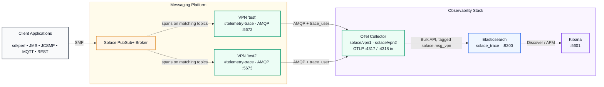

# Solace Distributed Tracing Observatory

[](docker-compose.yaml)
[](https://solace.com/products/event-broker/)
[](https://opentelemetry.io/)
[](https://www.elastic.co/elasticsearch/)
[](https://www.elastic.co/kibana/)

Distributed tracing for a Solace PubSub+ broker, collected via the broker's
native telemetry/trace feature over AMQP, bridged into OpenTelemetry by the
`solace` receiver, stored in Elasticsearch, and explored in Kibana.

This reproduces a working OpenShift deployment without OpenShift — no
operators, no CRs, no cloud object store. Same architecture, same failure
modes, same lessons; plain containers instead. It's a variant of the
`grafana-dt` tracing pillar on this repo, swapping Tempo/Grafana for the
Elastic Stack.



---

## Get this branch

This work lives on its own branch, separate from `main` and from the other
observability pillars in this repo:

```bash
git clone --branch elastic-dt https://github.com/Tanendra77/solace-grafana-observatory.git
cd solace-grafana-observatory
```

Already have the repo cloned on another branch?

```bash
git fetch origin elastic-dt
git checkout elastic-dt
```

Browse it on GitHub: [`Tanendra77/solace-grafana-observatory` @ `elastic-dt`](https://github.com/Tanendra77/solace-grafana-observatory/tree/elastic-dt).

---

## Quick start

```bash
cp .env.example .env    # then review it — at minimum the credentials
```

**1. Start a broker**, if you don't already have one running:

```bash
docker compose -f docker-compose.broker.yaml up -d
```

Give it 60-90 seconds on first boot — it's building its config database.
Then configure it for tracing (VPN, AMQP, telemetry profile, trace filter,
both client users — idempotent, safe to re-run):

```bash
./scripts/setup-broker-tracing.sh
```

The stack traces two Message VPNs. Run the same script again for the second
one, selecting the override file rather than exporting variables — see
[Tracing more than one Message VPN](#tracing-more-than-one-message-vpn) for
why that distinction matters:

```bash
cp .env.vpn2.example .env.vpn2
ENV_FILE=.env.vpn2 ./scripts/setup-broker-tracing.sh
```

Already have a broker (your own, or one shared with another pillar)? Skip
starting `docker-compose.broker.yaml` and point `.env` at it instead — see
[Using your own broker](#using-your-own-broker).

**2. Start the tracing stack:**

```bash
docker compose up -d
```

First run pulls the Elasticsearch and Kibana images (~2GB each) — give it a
few minutes on a cold Docker cache. After that, Elasticsearch itself still
takes longer than the other services to become healthy — the collector waits
for it (`depends_on: service_healthy`) before connecting.

**3. Send some traffic, then check it worked.** Don't have `sdkperf` installed?
Skip straight to `verify.sh` and use the broker's **Try Me!** web UI instead —
see [Sending traffic](#sending-traffic) for every option, none of which need
anything installed beyond a browser.

```bash
sdkperf_java.sh -cip=localhost:55555 -cu=dtuser@test -cp=dtuser_pw \
                -ptl=test/trade/new -mn=100 -mr=10

sdkperf_java.sh -cip=localhost:55555 -cu=dtuser@test2 -cp=dtuser_pw \
                -ptl=test2/trade/new -mn=100 -mr=10

./scripts/verify.sh
ENV_FILE=.env.vpn2 ./scripts/verify.sh
```

Traces appear at **http://localhost:5601** → **Discover**, on a data view over
`solace_trace` (create one the first time: Discover will offer to build it for
you, or do it under Stack Management → Data Views). Both VPNs write there;
split them with a filter on `resource.attributes.solace.msg_vpn`. The
**Observability → APM** view gives service maps and span waterfalls over the
same data.

**4. Stop everything** when you're done — data is kept, nothing needs redoing
on the next `up`:

```bash
docker compose down
docker compose -f docker-compose.broker.yaml down
```

Nothing needs redoing after a restart — `docker compose down` (on either or
both files) and back `up` preserves broker config and traces. Add `-v` to a
`down` to discard a given stack's volumes and start that piece over; nothing
does this automatically.

---

## Common commands

| Command | What it does |
|---|---|
| `docker compose -f docker-compose.broker.yaml up -d` | Start the broker. |
| `docker compose -f docker-compose.broker.yaml down` | Stop the broker. Data kept. |
| `docker compose up -d` | Start the tracing stack (collector, Elasticsearch, Kibana). |
| `docker compose down` | Stop the tracing stack. Data kept. |
| `docker compose -f docker-compose.yaml -f docker-compose.jsonl.yaml up -d` | Start the stack with the JSONL sink layered in. |
| `docker compose logs -f [service]` | Follow logs. |
| `docker compose ps` | Show container status. |
| `./scripts/setup-broker-tracing.sh` | (Re-)apply broker tracing config over SEMP. Idempotent. |
| `ENV_FILE=.env.vpn2 ./scripts/setup-broker-tracing.sh` | Same, for the second traced VPN. |
| `./scripts/verify.sh` | Check every hop; prints the fix for whatever failed. |
| `ENV_FILE=.env.vpn2 ./scripts/verify.sh` | Same, for the second traced VPN. |
| `./scripts/verify.sh --persistence` | Also restart and confirm state survives. |

Run these from Git Bash or WSL on Windows. The two compose files are
independent — `docker compose` commands without `-f` operate on
`docker-compose.yaml` (the tracing stack); add `-f docker-compose.broker.yaml`
to target the broker instead.

---

## Sending traffic

Nothing here generates messages — bring your own client. Any of these work,
and none need instrumenting: the broker produces spans for every message
matching the trace filter, whatever published it.

**sdkperf**

```bash
sdkperf_java.sh -cip=localhost:55555 -cu=dtuser@test -cp=dtuser_pw \
                -ptl=test/trade/new -mn=100 -mr=10
```

**The broker's own Try Me!** — http://localhost:8080 → VPN `test` → Try Me!
→ Connect → Publish.

**Your own application** — connect to `localhost:55555`, VPN `test`, user
`dtuser`.

Exact credentials come from `.env`. Swap `test` for `test2` to publish on the
second traced VPN — SMF (`:55555`) is one port for all VPNs, unlike AMQP.

---

## Tracing more than one Message VPN

One collector consumes both VPNs. The obvious config for this —

```yaml
solace:
  broker: ["broker:5672", "broker:5673"]    # does NOT work
```

— is not available. The `broker` list takes exactly one entry; it is a list for
future HA, not for fan-out. Three constraints force the actual shape:

1. **A telemetry profile is per-Message-VPN.** Each VPN spools its spans to its
   own `#telemetry-<profile>` queue. VPN 2's spans can never appear in VPN 1's
   queue, so there is no single queue to consume.
2. **One receiver binds one queue** — `queue:` is a scalar.
3. **AMQP binds to exactly one Message VPN per listen port.** The port *is* the
   VPN selector, which is why VPN 2 needs its own (`5673`) and why no
   `user@vpn` username convention is involved.

So: one `solace` receiver per VPN, in one collector.

```yaml
receivers:
  solace/vpn1:
    broker: ["${env:SOLACE_BROKER_HOST}:${env:SOLACE_BROKER_AMQP_PORT}"]
    queue: ${env:SOLACE_TELEMETRY_QUEUE}
  solace/vpn2:
    broker: ["${env:SOLACE_BROKER_HOST}:${env:SOLACE_BROKER_AMQP_PORT_2}"]
    queue: ${env:SOLACE_TELEMETRY_QUEUE}    # same name, different VPN — correct
```

Both write to the same `solace_trace` index, tagged by VPN so they can be told
apart in Kibana:

```yaml
processors:
  resource/vpn1:
    attributes:
      - { key: solace.msg_vpn, value: "${env:SOLACE_MSG_VPN}", action: upsert }
```

This tag duplicates data the receiver already provides — it also puts the VPN
name in `service.instance.id`. The explicit tag is kept anyway: a field called
`service.instance.id` holding a Message VPN is undocumented receiver behaviour
that can change between versions, and it reads as nonsense on a dashboard. Drop
both processors and merge the pipelines back into one if you'd rather filter on
the receiver's field and carry less config.

The traces pipeline is split per VPN (`traces/vpn1`, `traces/vpn2`) for one
reason only: `resource` applies to a whole pipeline, so tagging each stream
differently means one pipeline each. OTLP gets a third, `traces/otlp`, with no
`resource` processor — spans from an instrumented app didn't come from a
Message VPN, and stamping one on them would be a lie in the data.
`memory_limiter` and `batch` stay shared instances across all three — one
memory budget for the process, one batcher feeding Elasticsearch.

**Adding a third VPN:** another `solace/vpn3` receiver on its own port, another
`resource/vpn3`, another pipeline, another `.env.vpn3` — plus the port published
in `docker-compose.broker.yaml` and passed through in `docker-compose.yaml`.
Every pipeline must also be named in `config/otel/jsonl-overlay.yaml`; naming a
pipeline there that doesn't exist in `collector.yaml` declares a *new* one with
no receivers, and the collector refuses to start with
`service::pipelines::traces: must have at least one receiver`.

### Why `ENV_FILE=` and not an exported variable

`setup-broker-tracing.sh` and `verify.sh` both source their env file with
`set -a`, which **overwrites anything exported on the command line**. So this
does not do what it looks like:

```bash
SOLACE_MSG_VPN=test2 ./scripts/setup-broker-tracing.sh    # silently reconfigures test
```

Selecting the file is the override that works. `.env.vpn2` sources `.env` and
changes only the two values that differ, so there is nothing to keep in sync:

```bash
. ./.env
SOLACE_MSG_VPN="${SOLACE_MSG_VPN_2}"
SOLACE_BROKER_AMQP_PORT="${SOLACE_BROKER_AMQP_PORT_2}"
```

Everything else is deliberately identical between the two runs — profile name,
trace user, ACL wiring, spool sizes. Those objects are scoped to their own VPN,
so reusing the names across VPNs is correct, not a collision.

### One collector or two?

One, until a reason appears. A single collector means one container, one
config, one set of ports, and shared batching to Elasticsearch; per-VPN
visibility survives anyway, because `otelcol_receiver_accepted_spans` on
`:8888` is labelled by receiver name.

The cost is a shared blast radius: `memory_limiter` is a single global budget,
so a burst on one VPN sheds the other's spans too, and a restart takes both
down. Split into two collectors when one VPN's volume actually starts starving
the other, or when the two need independent upgrades — that costs a second set
of every port (`13133`, `8888`, `55679`, `4317`/`4318`).

---

## Using your own broker

Skip `docker-compose.broker.yaml` entirely and set in `.env`:

```env
SOLACE_BROKER_HOST=your-broker.example.com      # reachable from inside docker
SOLACE_BROKER_AMQP_PORT=5672
SOLACE_SEMP_URL=http://your-broker.example.com:8080
```

`SOLACE_BROKER_HOST` is resolved **from inside the Docker network**, so
`localhost` will not work — it would point at the container itself. Use a
hostname, a routable IP, or `host.docker.internal` for a broker running on
your machine outside Docker.

Then run the tracing setup against it:

```bash
./scripts/setup-broker-tracing.sh
```

It configures a remote broker exactly as it does a local one, provided the
admin credentials in `.env` are right. If you don't have admin, or the broker
is already set up, set `BOOTSTRAP_ENABLED=false` and configure it yourself —
`scripts/setup-broker-tracing.sh` is readable as a specification of exactly
what needs to exist on the broker.

### Manual setup (no script, via PubSub+ Manager)

Same result as `setup-broker-tracing.sh`, done by hand at http://localhost:8080:

- **Message VPNs** → Create VPN `test`, enable it, set Max Spool Usage (e.g. 1500 MB).
- **Message VPNs → default → Services → AMQP** → disable the Plain Text service (frees port 5672).
- **Message VPNs → test → Services → AMQP** → set port `5672`, enable the Plain Text service.
- **Message VPNs → test → Access Control → Client Profiles → default** → enable Guaranteed Messaging (send / receive / endpoint create).
- **Message VPNs → test → Access Control → ACL Profiles → default** → set Client Connect / Publish Topic / Subscribe Topic default actions to Allow.
- **Message VPNs → test → Access Control → Client Usernames** → create `dtuser`, ACL profile `default`, Client profile `default`, enabled.
- **Message VPNs → test → Telemetry** → create profile `trace`, enable Receiver and Trace.
- Inside profile `trace` → **Trace Filters** → create filter `allmsgs`, enabled → **Subscriptions** → add `>`.
- **Message VPNs → test → Access Control → Client Usernames** → create `trace_user`, ACL profile `#telemetry-trace`, Client profile `#telemetry-trace` (both auto-created by the telemetry profile), enabled.

For the second traced VPN, repeat every step above for VPN `test2`, with one
change: its AMQP Plain Text port is `5673`, not `5672`. AMQP listen ports must
be unique broker-wide. Nothing else differs — the profile, filter and usernames
are scoped to their VPN, so they keep the same names.

---

## Configuration

Everything lives in `.env`, which is documented inline and gitignored. The
YAML files read from it; don't hardcode values in them.

Things worth knowing:

- **`SOLACE_BROKER_HOST`** (default `host.docker.internal`) is read by the
  `otel-collector` container — `host.docker.internal` reaches a broker on
  this machine from inside Docker. **`SOLACE_SEMP_URL`** (default
  `http://localhost:8080`) is read by the setup/verify scripts, which run on
  your host — `host.docker.internal` does not reliably resolve there, so it
  uses `localhost` instead. Point both elsewhere for a remote or shared broker.
- **`TRACE_FILTER_SUBSCRIPTION`** defaults to `>`, meaning every topic is
  traced. Narrow it for anything resembling production — tracing everything
  is expensive at volume.
- **`TRACE_FILE_ENABLED`** turns on a second sink writing every span to
  `trace-data/traces.jsonl`, alongside Elasticsearch. Off by default — layer
  in `docker-compose.jsonl.yaml` when it's on.
- **`OTEL_LOG_LEVEL`** is `info`. Spans still print to the collector log at
  that level (the debug *exporter* logs at info). Raise it to `debug` only to
  diagnose the AMQP connection itself.
- **`VERIFY_LOOKBACK_HOURS`** is how far back `verify.sh` searches
  Elasticsearch, defaulting to a week. Too narrow a window makes a stack left
  idle overnight report perfectly good traces as missing, which points the
  blame at the collector instead of the clock.
- **`ES_HEAP_MB`** sizes the Elasticsearch JVM heap (`Xms`/`Xmx` set equal, as
  Elastic recommends). 1024 is enough for local-dev trace volumes; raise it
  if Elasticsearch is OOM-killed under load.
- **Elasticsearch security is off** (`xpack.security.enabled=false`) —
  matches the rest of this branch's local-dev-friendly, no-TLS defaults.
  Don't run this configuration anywhere reachable by anyone you don't trust.
- **Image tags are pinned deliberately.** The collector's config schema
  changes between releases, and floating tags drift out from under a working
  setup with no signal that anything changed.

### Adding instrumented applications later

The collector's OTLP ports are published on the host (`4317` gRPC, `4318`
HTTP). Point an instrumented app at either and its spans land in the same
Elasticsearch alongside the broker's, in the same `solace_trace` index. OTLP
has its own `traces/otlp` pipeline with no `resource` processor: those spans
did not come from a Message VPN, so they carry no `solace.msg_vpn` tag rather
than a misleading one.

---

## Troubleshooting

`./scripts/verify.sh` diagnoses all of the below and prints the fix. This
table is for understanding *why*.

| Symptom | Cause | Fix |
|---|---|---|
| Collector running, no spans anywhere | AMQP bound to the wrong Message VPN | `./scripts/setup-broker-tracing.sh` |
| Collector running, no spans anywhere | auth or ACL failure — the collector retries silently and never crashes | `./scripts/verify.sh`, then check the trace credentials |
| Broker produces spans, queue keeps growing | collector not consuming | `docker compose logs otel-collector` |
| Elasticsearch search returns `index_not_found_exception` | the `traces-*` data stream doesn't exist until the first span is indexed | expected on a fresh stack — send traffic first |
| `verify.sh` finds no traces after the stack sat idle | traffic is older than the search window | raise `VERIFY_LOOKBACK_HOURS`, or send fresh traffic |
| Elasticsearch not answering right after `up` | cold JVM start, allocating heap and the data dir | wait ~60-90s |
| Elasticsearch exits immediately, log mentions `vm.max_map_count` | the Docker host's kernel mmap limit is too low for ES's storage engine | `sysctl -w vm.max_map_count=262144` on the host (native Linux Docker Engine only — Docker Desktop on Mac/Windows already sets this) |
| Kibana shows "Kibana server is not ready yet" | still waiting on Elasticsearch, or Elasticsearch isn't healthy | `./scripts/verify.sh`, check `docker compose logs elasticsearch` |
| Broker container restarting in a loop | an invalid `username_admin_globalaccesslevel` value | must be `admin`, not `global/admin` |
| Collector exits at startup: `service::pipelines::traces: must have at least one receiver` | `jsonl-overlay.yaml` names a pipeline that no longer exists in `collector.yaml`, which declares an empty new one instead of extending an existing one | make the pipeline names in both files match |
| One VPN's spans arrive, the other's never do | that VPN's AMQP port isn't listening, or the bootstrap only ran for the first VPN | `ENV_FILE=.env.vpn2 ./scripts/verify.sh` — its AMQP check names the port it expected |
| Bootstrap reconfigured the wrong VPN | `SOLACE_MSG_VPN=x ./scripts/...` — the script's `set -a` sourcing overwrites exported variables | use `ENV_FILE=.env.vpn2` instead; exporting the variable cannot work |
| Both VPNs' spans land in Elasticsearch but can't be told apart | `SOLACE_MSG_VPN`/`SOLACE_MSG_VPN_2` not reaching the collector container | they must be listed in `docker-compose.yaml`'s `environment:`; check `resource.attributes.solace.msg_vpn` exists on a document |
| Aggregating on `solace.msg_vpn` fails with `Fielddata is disabled` | the index was created by dynamic mapping, so the field is `text` with a `.keyword` subfield rather than a plain keyword | aggregate on `resource.attributes.solace.msg_vpn.keyword`; Kibana filters work on either |
| Publishing over AMQP is rejected with `Queue Not Found` | Solace AMQP reads a bare address as a **queue** name | prefix the topic: `topic://test/trade/new` |
| Traffic published successfully, queue's `lastSpooledMsgId` never moves, everything else checks out | the telemetry queue's spooling got stuck on a broker volume reused across sessions/branches — not fixable via SEMP, it's a broker-internal object | `docker compose -f docker-compose.broker.yaml down -v` for a clean volume, then `up -d` and `./scripts/setup-broker-tracing.sh` again |

Two traps deserve emphasis, because both present as a perfectly healthy
stack:

**AMQP binds to exactly one Message VPN.** Out of the box that is `default`.
If it stays there while your traffic and telemetry profile are on `test`,
the collector connects successfully, binds nothing, and reports itself
healthy indefinitely. `scripts/setup-broker-tracing.sh` moves it; don't undo
that by hand. This is also why each traced VPN needs its own AMQP port, unique
broker-wide — see [Tracing more than one Message
VPN](#tracing-more-than-one-message-vpn).

**The telemetry queue is not in the config API.** It is broker-internal and
appears only under `/SEMP/v2/monitor`. Querying
`/SEMP/v2/config/.../queues` makes a perfectly good queue look missing.

---

## Layout

```
docker-compose.broker.yaml     standalone broker — start this first (or use your own)
docker-compose.yaml            the tracing stack: OTel collector, Elasticsearch, Kibana
docker-compose.jsonl.yaml      overlay adding the JSONL sink
.env.example                   every setting, documented
.env.vpn2.example              overrides for bootstrapping the second traced VPN
config/
  otel/collector.yaml          collector pipelines — one per traced VPN, plus OTLP
  otel/jsonl-overlay.yaml      merged in when the JSONL sink is on
scripts/
  setup-broker-tracing.sh      idempotent SEMP v2 bootstrap, run from the host
  verify.sh                    hop-by-hop checks
trace-data/                    JSONL output when the file sink is enabled
```

Elasticsearch and Kibana take no config files of their own here — everything
they need (single-node discovery, no security, which cluster Kibana talks
to) is set as container environment in `docker-compose.yaml`.

---

## References

- [Solace SEMP v2 API](https://docs.solace.com/API-Tools/SEMP/SEMP-API.htm) — the API `scripts/setup-broker-tracing.sh` talks to; also documents the telemetry profile and trace filter objects it configures.
- [Solace distributed tracing](https://docs.solace.com/Observability/distributed-tracing-overview.htm) — the broker's native tracing feature this stack is built on: telemetry profiles, trace filters, the AMQP telemetry queue.
- [OpenTelemetry Collector Contrib — Solace receiver](https://github.com/open-telemetry/opentelemetry-collector-contrib/tree/main/receiver/solacereceiver) — the receiver that bridges the AMQP telemetry queue into OTLP; documents every collector env var this stack sets.
- [OpenTelemetry Collector Contrib — Elasticsearch exporter](https://github.com/open-telemetry/opentelemetry-collector-contrib/tree/main/exporter/elasticsearchexporter) — the exporter writing spans into Elasticsearch, including `mapping.mode: otel` and the data streams it produces.
- [Elasticsearch documentation](https://www.elastic.co/guide/en/elasticsearch/reference/current/index.html) — data streams, index lifecycle management, single-node cluster health semantics.
- [Kibana documentation](https://www.elastic.co/guide/en/kibana/current/index.html) — Discover, data views, and the Observability → APM UI used to explore traces here.
- `doc/solace-observability-readme.md` — the OpenShift build this stack reproduces locally. Gitignored (internal reference material) — present only if you already have it locally, not part of this repo.
